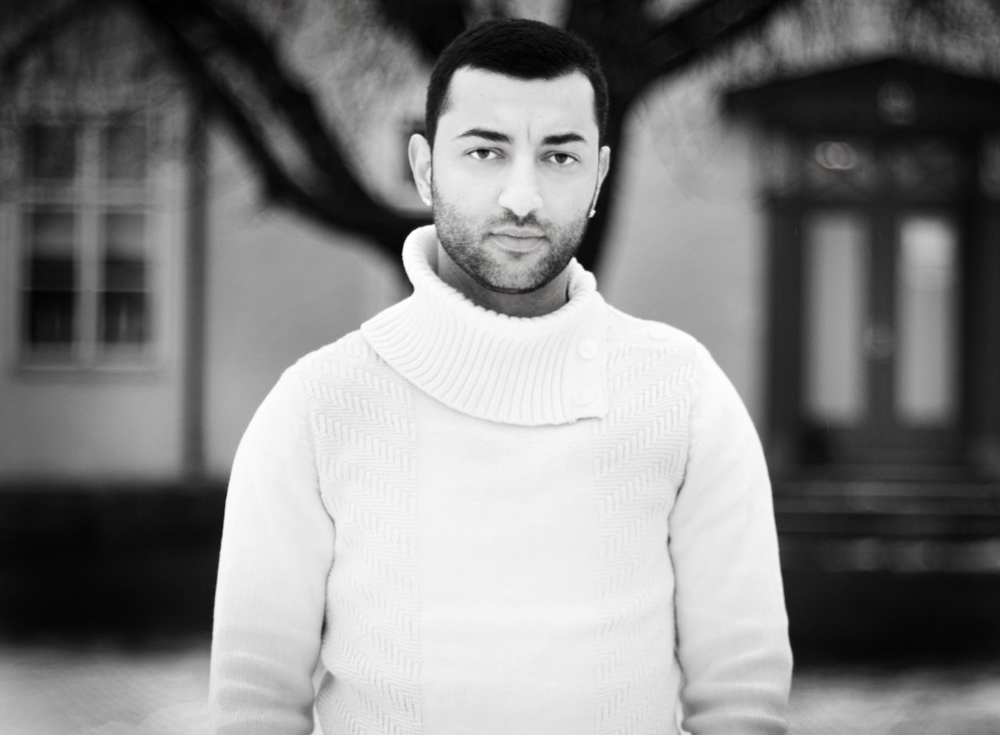

# Hi there 👋

### About me! 

--
__Hi__ My name is Wisam Petros Odish, I am a father of **two** beautiful kids, my oldest one, a girl named Kiara and my youngest one, a boy named Keanu. 

I'v currently finished up my Python backend developer at DCI.
My background is in 3D art and Level Design for Mobile and Console/PC Games.

As I mentioned with my background as a 3D artist in the game industry, I would love to create tools that artist can make use off! Here are some of the stuff I am allowed to show from my experience [Portfolio](https://www.artstation.com/wirrexx/albums/all).

But with my newly learned coding skills I am going to take the opportunity to create Plugins for the tools that i daily use (Automation). 

During my **freetime**, you will find me in the gym, watching sports, playing games or ***spending my time with my kids and fiancée!***

Who are you?

Someone that wants to evolve just like me. 

Someone who is willing to grow continuily.

Proper ticket based work, scrum or something similiar!

Nice to have:

Self education time on company Time! 

<!--
**wirrexx/wirrexx** is a ✨ _special_ ✨ repository because its `README.md` (this file) appears on your GitHub profile.

Here are some ideas to get you started:

- 🔭 I’m currently working on ...
- 🌱 I’m currently learning ...
- 👯 I’m looking to collaborate on ...
- 🤔 I’m looking for help with ...
- 💬 Ask me about ...
- 📫 How to reach me: ...
- 😄 Pronouns: ...
- ⚡ Fun fact: ...
-->
